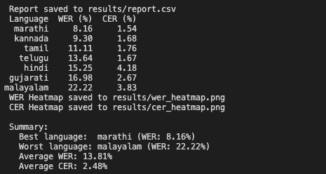
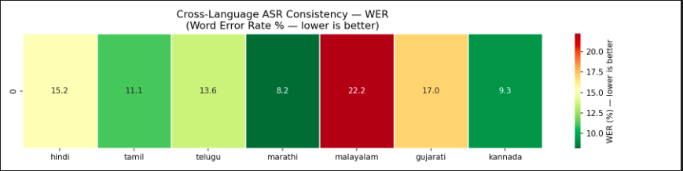
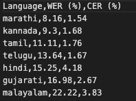

# indic-asr-eval

A cross-language ASR evaluation tool that benchmarks speech recognition consistency across Indic languages, computing WER (Word Error Rate) and CER (Character Error Rate) metrics with heatmap visualizations.

The tool can be used both through a command-line interface and a browser-based web UI built with FastAPI and React, making it easier to run evaluations, compare results, and visualize performance across languages.

Built as a contribution to the [AI4I Core](https://github.com/COSS-India/ai4i-core) platform — an open-source platform for Indic language AI services.

---

## What is this?

AI4I Core provides ASR (Automatic Speech Recognition) for Indian languages. But how consistently does it perform across languages? Does it work equally well for all languages?

This tool answers that question by:
1. Taking audio samples in multiple Indic languages
2. Sending them to the ASR inference endpoint
3. Comparing transcriptions against reference text
4. Calculating WER and CER per language
5. Generating heatmaps and a CSV report

---

## Architecture


## Tech Stack

| Tool | Purpose |
|---|---|
| Python 3.11 | Core language |
| gTTS | Text-to-speech audio generation |
| FastAPI | Backend API |
| pydub | MP3 to float array conversion |
| ffmpeg | Audio processing (required by pydub) |
| jiwer | WER and CER calculation |
| numpy | Audio signal processing |
| pandas | Results table |
| seaborn + matplotlib | Heatmap generation |
| requests | HTTP calls to ASR endpoint |
| googletrans | Translation support |

---
## Supported Languages

| Language | Code |
|---|---|
| Hindi | hi |
| Tamil | ta |
| Telugu | te |
| Marathi | mr |
| Malayalam | ml |
| Gujarati | gu |
| Kannada | kn |

---
## Project Structure

```text
indic-asr-eval/
│
├── backend/
│   └── main.py
│
├── frontend/
│   ├── src/
│   ├── public/
│   └── package.json
│
├── audio/
│   └── Generated MP3 files
│
├── references/
│   └── references.json
│
├── results/
│   ├── report.csv
│   ├── wer_heatmap.png
│   └── cer_heatmap.png
│
├── asr_eval.py
├── generate_audio.py
├── requirements.txt
├── ADDING_LANGUAGES.md
└── README.md
```
---

## Dataset — references.json

The `references/references.json` file contains the test dataset used for evaluation. It has **10 everyday sentences** translated into all 7 supported languages. These sentences were chosen to reflect practical, real-world usage of the AI4I platform.

You can use the existing dataset as-is, or create your own custom dataset with your own sentences and languages.

See [ADDING_LANGUAGES.md](./ADDING_LANGUAGES.md) for a step-by-step guide on how to:
- Add new sentences to the dataset
- Add new languages
- Generate your own audio files using gTTS
- Run evaluation on your custom dataset

---

## Prerequisites

Make sure you have the following installed before starting:

**1. Python 3.11**
- Download from [python.org](https://www.python.org/downloads/)
- Verify: `python3.11 --version`

**2. ffmpeg**
```bash
# Mac
brew install ffmpeg

# Ubuntu/Linux
sudo apt install ffmpeg -y

# Windows
# Download from https://ffmpeg.org/download.html and add to PATH
```

**3. Git**
- Download from [git-scm.com](https://git-scm.com)
- Verify: `git --version`

**4. ASR Endpoint Access**
- You need access to an AI4I inference server running Triton
- The endpoint format is: `http://<server-ip>:5000/v2/models/asr_am_ensemble/infer`
- If you don't have access, use [Mock Mode](#running-in-mock-mode)

**5. Node.js and npm**
- Required for running the React frontend
- Download from [nodejs.org](https://nodejs.org)
Verify:
`node --version`
`npm --version`
---
## Setup

**Step 1 — Clone the repo:**
```bash
git clone https://github.com/NandithaNair19/asr-model-eva
cd asr-model-eva
```

**Step 2 — Create a virtual environment:**
```bash
# Mac/Linux
python3.11 -m venv venv
source venv/bin/activate

# Windows
python3.11 -m venv venv
venv\Scripts\activate
```

**Step 3 — Install dependencies:**
```bash
pip install -r requirements.txt
```

**Step 4 — Generate audio files:**
```bash
python3 generate_audio.py
```
This creates 70 MP3 files in the `audio/` folder (10 sentences × 7 languages).

**Step 5 — Configure the ASR endpoint:**

Copy the example env file:
```bash
cp .env.example .env
```

Open `.env` and set your server IP:
```
ASR_ENDPOINT=http://<your-server>:5000/v2/models/asr_am_ensemble/infer
USE_MOCK=false
```

**Step 6 — Run the evaluation:**
```bash
python3 asr_eval.py
```

---

## Running in Mock Mode

If you don't have access to the ASR endpoint, run the tool in mock mode which simulates ASR responses and demonstrates the full pipeline:

Note: Only step 5 changes here.

Copy the example env file:
```bash
cp .env.example .env
```

Open `.env` and leave the ASR_ENDPOINT server IP as it is and chnage the USER_MOCK to false:
```
ASR_ENDPOINT=http://<your-server>:5000/v2/models/asr_am_ensemble/infer
USE_MOCK=false
```

Then run:
```bash
python3 asr_eval.py
```

Mock mode reads the real audio files but simulates transcription errors so you can see the full output without needing the endpoint.

---
# Running the Web UI

The project includes a FastAPI backend and a React frontend for running evaluations through a browser.

## Start the Backend

```bash
cd backend
uvicorn main:app --host 0.0.0.0 --port 8000 --reload
```

The backend will be available at:

```text
http://localhost:8000
```

---

## Frontend Setup

Open a new terminal and run:

```bash
cd frontend
npm install
npm start
```

The frontend will be available at:

```text
http://localhost:3000
```

---
## Using the UI

1. Open `http://localhost:3000` in your browser.
2. Enter the text you want to evaluate.
3. Click **Run Evaluation**.
4. View the generated audio, transcription output, WER, and CER directly in the browser along with the heatmaps.

---
## Output

### Terminal
The terminal output should look something like this:


### WER Heatmap


### CER Heatmap


### results/report.csv


---

## Troubleshooting

### `ModuleNotFoundError: No module named 'pydub'`
```bash
pip install pydub
```

### `FileNotFoundError: ffprobe not found`
ffmpeg is not installed or not in PATH.
```bash
# Mac
brew install ffmpeg

# Linux
sudo apt install ffmpeg -y
```

### `Connection refused` on ASR endpoint
- Check the server IP and port are correct
- Verify the Triton inference server is running
- Check your network can reach the server
- Test connectivity: `curl http://<server-ip>:5000/v2/health/ready`

### `KeyError: 'outputs'` from ASR response
The model name might be wrong. Check available models:
```bash
curl http://<server-ip>:5000/v2/models
```

### `FileNotFoundError: audio/<lang>_<id>.mp3`
Audio files not generated yet. Run:
```bash
python3 generate_audio.py
```

### `ModuleNotFoundError: No module named 'audioop'`
You are using Python 3.13 which removed the `audioop` module. Switch to Python 3.11:
```bash
python3.11 -m venv venv
source venv/bin/activate
pip install -r requirements.txt
```
### `ModuleNotFoundError: No module named 'fastapi'`

Install the project dependencies again:

```bash
pip install -r requirements.txt
```

### `ModuleNotFoundError: No module named 'googletrans'`

Install the required version:

```bash
pip install googletrans==4.0.0rc1
```

### Frontend fails to start

Make sure Node.js and npm are installed.

Verify:

```bash
node --version
npm --version
```

Then install frontend dependencies:

```bash
cd frontend
npm install
```

### Port 3000 already in use

Another application is already using the React development server port.

Run on a different port:

```bash
PORT=3001 npm start
```

### Port 8000 already in use

Another application is already using the FastAPI backend port.

Run on a different port:

```bash
uvicorn main:app --host 0.0.0.0 --port 8001 --reload
```

### Frontend cannot connect to backend

Make sure the backend is running before starting the frontend.

Backend:

```bash
cd backend
uvicorn main:app --host 0.0.0.0 --port 8000 --reload
```

Frontend:

```bash
cd frontend
npm start
```

### Changes to `.env` are not taking effect

Restart the backend after modifying `.env`:

```bash
Ctrl + C
uvicorn main:app --host 0.0.0.0 --port 8000 --reload
```

### Real ASR mode is not working

Verify that the `.env` file contains:

```env
ASR_ENDPOINT=http://<server-ip>:5000/v2/models/asr_am_ensemble/infer
USE_MOCK=false
```

If endpoint access is unavailable, switch to mock mode:

```env
USE_MOCK=true
```

### WER is 0% for all languages in mock mode
This is expected if no errors were randomly introduced. Run again — mock mode uses random error rates so results vary each run.

---
## End-to-End Testing

An end-to-end test script is included that runs the full pipeline from scratch — cloning the repo, setting up the environment, generating audio, and running both mock and real ASR evaluation.

> **Note:** The script clones the repo to `~/Downloads/cross-lingual-asr-eval` by default. If you want to change the location, update these two lines in `test_e2e.sh`:
> ```bash
> run "git clone https://github.com/NandithaNair19/asr-model-eva.git ~/<your-folder>/<your-name>"
> cd ~/<your-folder>/<your-name>
> log "$ cd ~/<your-folder>/<your-name>"
> ```

### Run the test

```bash
chmod +x test_e2e.sh
./test_e2e.sh
```

The script will:
1. Clone the repo fresh
2. Set up Python 3.11 virtual environment
3. Install all dependencies
4. Generate audio files
5. Run evaluation in **mock mode**
6. Prompt you for the ASR endpoint IP to run in **real mode**
   - Press **Enter** to skip real mode if you don't have endpoint access
7. Check and display output files

### Output

All commands and their outputs are logged to `e2e_test_log.txt` in plaintext. This file documents the full run  of a successful end-to-end test.

---
## Cost Breakdown

| Resource | Cost |
|---|---|
| Python, all pip libraries | Free |
| ffmpeg | Free |
| gTTS audio generation (70 files) | Free |
| ASR endpoint (AI4I Triton server) | Provided by AI4I team |

**Running this tool locally is completely free** as long as you have access to the ASR endpoint.

---

## Limitations

### Language Coverage

This tool currently supports 7 Indic languages for audio generation using [gTTS (Google Text-to-Speech)](https://gtts.readthedocs.io/).

For languages like Garo, Khasi, Bodo, Mizo, and Tulu — gTTS does not provide support. However, the AI4I platform itself has TTS capabilities for a wider range of Indic languages. Ideally, the AI4I TTS endpoint would be used to generate audio for these languages, which would make this evaluation tool fully self-contained within the AI4I ecosystem.

Currently this is not possible due to a setup and configuration issue that prevents access to the TTS inference endpoint in the local setup. Once that is resolved, the audio generation script can be updated to use the AI4I TTS endpoint instead of gTTS, extending coverage to minority and tribal languages.

### Audio Quality Limitations

Since gTTS generates audio using a single synthetic voice, the current dataset does not account for:
- **Multiple speakers** — all audio is from one voice per language
- **Human-like natural speech** — gTTS lacks the natural pauses, tone variation, and rhythm of real human speech
- **Background noise** — all audio is clean with no ambient noise, which does not reflect real-world usage
- **Accents and dialects** — a single language can have many regional accents (e.g. Hindi spoken in Delhi vs UP vs Bihar sounds very different)
- **Gender variation** — no distinction between male and female voices

This means WER scores from this tool reflect performance on ideal, clean, synthetic audio and may not accurately represent real-world ASR performance. 

In the meantime, alternative options include:
- [IndicVoices-R](https://github.com/AI4Bharat/IndicVoices-R) — real human recordings for Bodo, Santali, Manipuri **(access required)**
- Native speaker recordings for truly unsupported languages like Garo and Khasi

See [ADDING_LANGUAGES.md](./ADDING_LANGUAGES.md) for more details on how to extend language coverage.

---

## Acknowledgements

This project was developed during an internship at the **Centre for Open Societal Systems (COSS)** as a contribution to the **AI4I (AI for Inclusion) Core** platform.

The work focuses on evaluating cross-language ASR consistency for Indic languages through automated benchmarking, WER/CER analysis, and visualization of recognition performance across languages.
